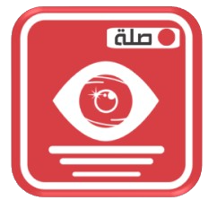

### Note: The App is under development
<!-- PROJECT LOGO -->

 

  
  
   
    <a href="">View App</a>

## About The Project

Describe It is an app that let anyone with vision impairment or low vision recognize their surrounding by using AI that reads the taken picture and describe it out loud. A person with low vision has multiple modes to choose from:
 *	General Recognition: Uses powerful AI to identify the environment of the taken picture.
 *	Color Recognition: Can recognize multiple colors of the taken picture.
 *	Food Recognition: Detect the name of any meal and its ingredients.
