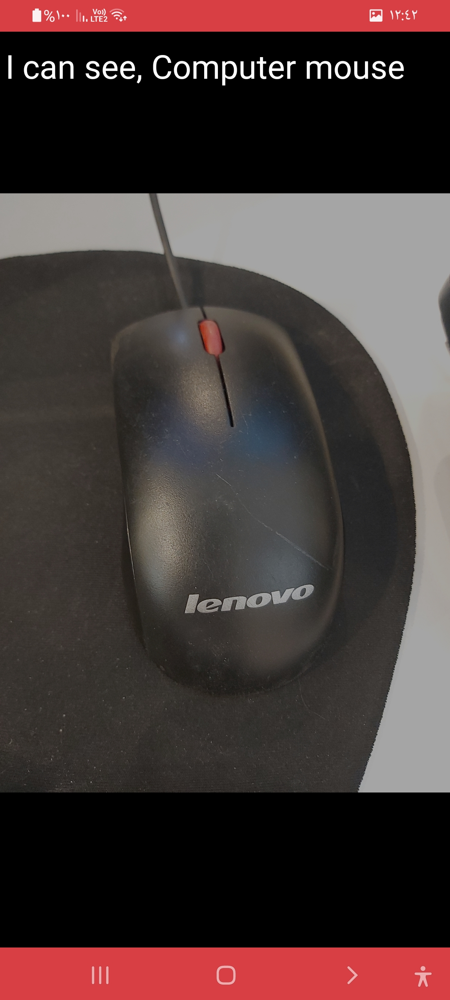

<!-- PROJECT LOGO -->

 

  
  
   
    <a href="/">View App</a>

 <!-- TABLE OF CONTENTS -->

  
Table of Contents

  <ol>
    <li>
      <a href="#about">About The Project</a>
      <ul>
        <li><a href="#recognition_types">Recognition types</a></li>
          <ul>
            <li><a href="#general">General</a></li>
            <li><a href="#color">Color</a></li>
            <li><a href="#food">Food</a></li>
        </ul>
     </ul>
    </li>
    <li>
      <a href="#overall_outcomes">Overall Outcomes/Achievements</a>
      <ul>
        <li><a href="#controls">Controls</a></li>
        <li><a href="#language_setting">Language Setting</a></li>
        <li><a href="#help">Help</a></li>
        <li><a href="#capture_examples">Capture Result Examples</a></li>
          <ul>
            <li><a href="#general_res">General Capture Result example</a></li>
            <li><a href="#color_res">Color Capture Result example</a></li>
            <li><a href="#food_res">Food Capture Result example</a></li>
          </ul>
      </ul>
    </li>
  </ol>

<!-- ABOUT THE PROJECT -->
<a name="about"/>

## About The Project

Describe It is an app that let anyone with vision impairment or people with low vision recognize their surrounding by using AI that reads the taken picture and understand it then generate a detailed describtion about what exisit in the picture and describe it out loud. 

<a name="recognition_types"/> 

### A person with low vision has multiple recognition type to choose from:

<a name="general"/> 

 *	General Recognition: Uses powerful AI to identify the environment of the taken picture.
 
    

      
      
    

    
    <a name="color"/> 

 *	Color Recognition: Can recognize multiple colors of the taken picture.

    

      
      
    

    
    <a name="food"/> 
 
 *	Food Recognition: Detect the name of any meal and its ingredients.

    

      
      
    

<a name="overall_outcomes"/>  

## Overall Outcomes/Achievements

  <a name="controls"/>  
  
  * Controls:

    <ul>
      <ul>
         <li>Users can Swipe Left-Or-Right to choose from diffrenet recognition types.</li>
         <li>Users can Long Press anywehre in the screen to display the current recognition type.</li>
         <li>Users can Click anywhere on the screen and the capture button will follow their touch position.</li>
       </ul>
    </ul>

    

      
    

    
  <a name="language_setting"/>  
    
  * Users can click on the language setting button to switch between English and Arabic language.
  
    

      
      
    

        
  <a name="help"/>  
    
  * Users can click on the help button to display the app help system.
  
    

      
      
    

  <a name="capture_examples"/>  
  
  * Capture Result Examples:

    <a name="general_res"/>  
  
    - General Capture Result example.

    

      
      
    

    <a name="color_res"/>  
    
    - Color Capture Result example.

    

      
      
    

    
    <a name="food_res"/>  
    
    - Food Capture Result example.

    

      
      
    

